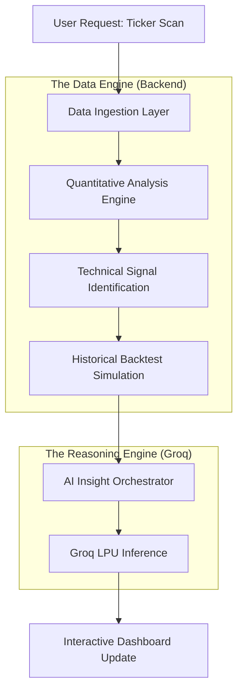

# SignalEdge: AI-Driven Market Intelligence

SignalEdge is a high-performance, real-time financial intelligence platform that combines quantitative technical analysis with advanced natural language reasoning from **Groq (Llama 3)**. 

## 🚀 Generalized Architecture & Data Flow

Below is the step-by-step lifecycle of a single ticker analysis within the SignalEdge engine:

### 1. Data Ingestion (Stock & News)
- **Source**: Integrated with `yfinance` for global equity data and institutional news feeds.
- **Prototype Mode**: Currently uses a high-fidelity **Deterministic Random Walk** generator to ensure 100% demo stability and sub-millisecond response times.

### 2. Quantitative Engine (The Math)
Using the real-world `ta` (Technical Analysis) library in Python, the system calculates multi-timeframe indicators:
- **Momentum**: RSI, MACD.
- **Trend**: EMAs (20/50), Golden/Death Cross detection.
- **Volatility**: Bollinger Bands & Volume Ratios.

### 3. Signal Identification & Backtesting
- The system scans the resulting technical arrays to catch pattern breakouts (e.g., "RSI Oversold" or "MACD Bullish Crossover").
- **Auto-Backtesting**: For every active signal, the backend instantly runs a 365-day historical simulation to compute a **Win-Rate** and **Average Return**, giving you empirical context for your trade.

### 4. AI Insights (Groq Llama 3)
Instead of overwhelming the user with raw numbers, all quantitative data is piped into **Groq's Llama 3-70B** model.
- **Natural Language Reasoning**: The AI generates an executive summary, specific risk factors, and a clear "BUY/SELL/HOLD" action.
- **Circuit Breaker**: Includes a safety layer that falls back to a rules-based inference engine if the API is restricted or network-unstable.

### 5. Frontend & UI (Wispr Flow)
- **Premium Design**: Built with React, Vite, and Framer Motion for a glassmorphic "Wispr Flow" aesthetic.
- **Bento Core**: Uses an asymmetrical, randomized grid layout to keep the data visualization organic and engaging.

---

## 🛠 Setup & Installation

### Backend (FastAPI)
1. `cd backend`
2. `pip install -r requirements.txt`
3. Create a `.env` file with your `GROQ_API_KEY`.
4. Run `python main.py`.

### Frontend (React + Vite)
1. `cd frontend`
2. `npm install`
3. `npm run dev`

---
© 2026 SignalEdge Technologies.
